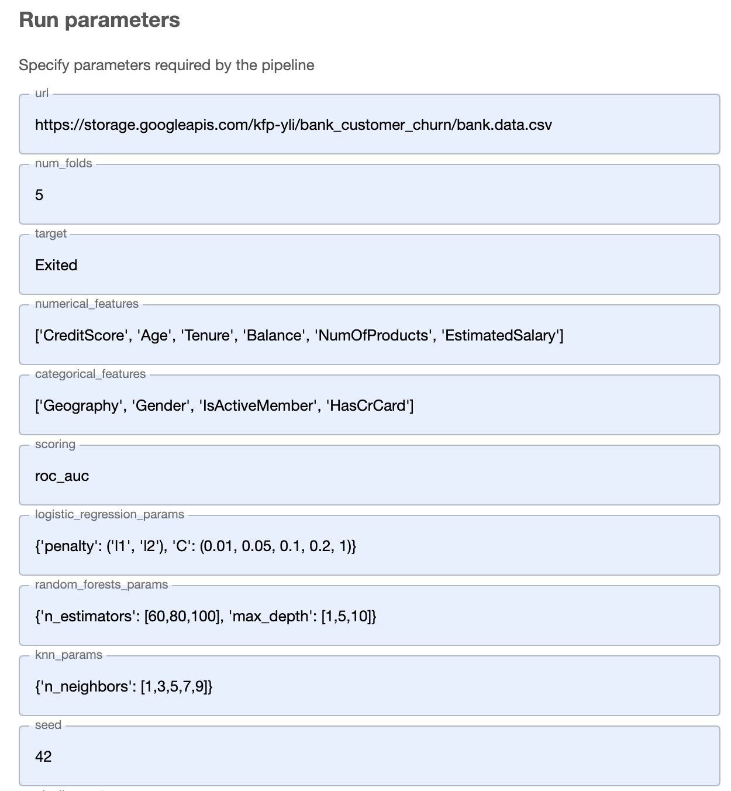
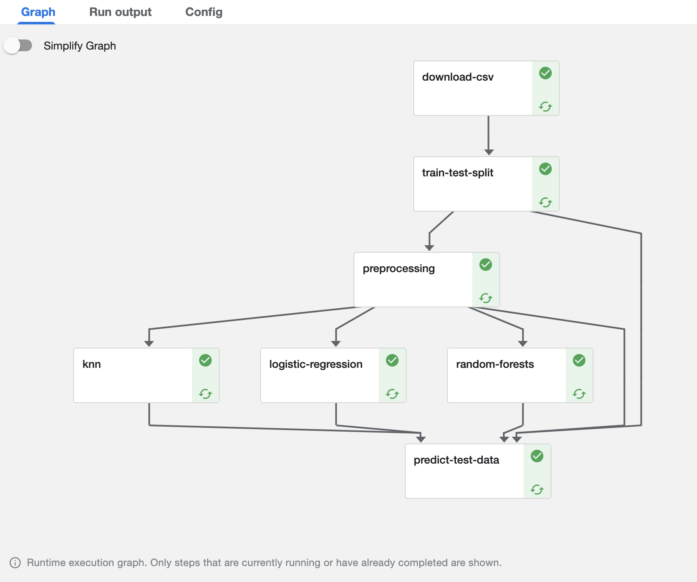

# bank-customer-churn-prediction

## A supervised machine learning project done with Kubeflow Pipeline

This repository store a simple ML classification project which I used to show how to leverage Kubeflow Pipeline to orchestrate a ML pipeline.

- This project features a classification problem, where we need to predict whether a given bank customer is likely to close their bank account or not.

- The EDA notebook shows explorative data analysis of the dataset. The dataset has both categorinal features and numerical features, and the target to be predicted is a binary label. Correlations between the features and the target as well as between the features themselves are analyzed in the EDA.

- The pipeline is constructed with the following components:

  - **Download:** The dataset is stored oneline. We initiate the pipeline by downloading it from the url and store it in a volume that our pipeline can have access to (in this case, I stored it in my Google Cloud Storage bucket).

  - **Train test split:** We split the dataset into training and test datasets (8:2). The test dataset serves as a holdout set and will be used to evaluate our model performance in the end.

  - **Data preprocessing:** Since the dataset has both categorical and numerical features. Before feeding them to a model, we first one-hot encode the categorical features and standardize the numerical features to keep them on the same scale. The `OneHotEncoder` and `StandardScaler` are fit to the training dataset, and then saved so that we can use them to transform the test dataset later on.

  - **Model training:** We train 3 base line models on the preprocessed training data - Logistic Regression, K Nearest Neighbors, and Random Forests. We perform a cross validation with each model and use Grid Search to find the optimal hyperparameters for the model. We can visualized the selected [evaluation metrics](./screenshots/knn_metrics.png) for each model

  - **Make predictions on the test dataset:** Finally, we use one of the three models that gives the best performance to predict the test dataset, and output [evaluation metrics](./screenshots/test_metrics.png). But before making the predictions, don't forget to first preprocess the test dataset using the previously saved `OneHotEncoder` and `StandardScaler`.

The pipeline can be compiled with the command `python make_pipeline.py`. A notebook version is also included in the repository.

## Use the pipeline

This pipeline can be generalized to any similar tabular dataset. The user-defined parameters are list below.

## Graph picture of the pipeline

## Docker

Kubeflow Pipeline is run on Kubernetes and each component is run within an individual container. In this project, all components use the same base docker image. A simple Dockerfile is included in `base_image_docker/`.
